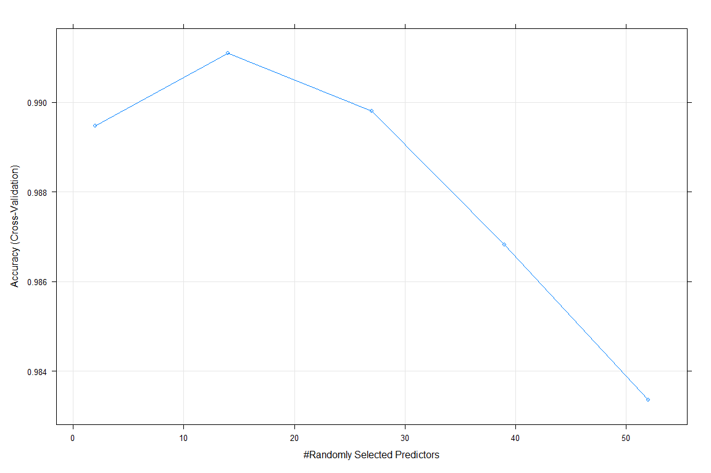
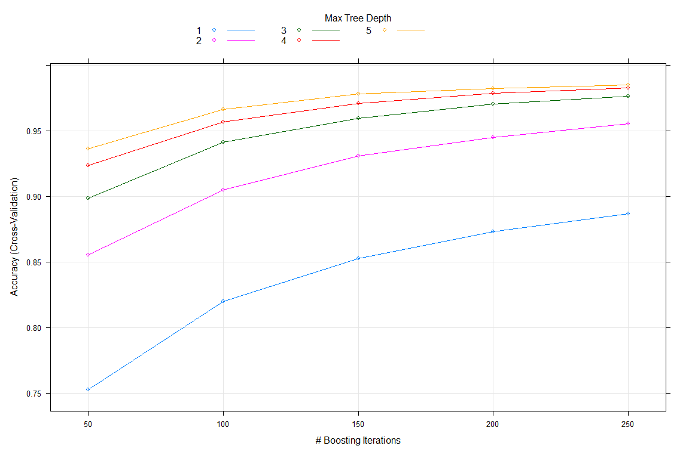

# Practical Machine Learning: Predicting Exercise Practice

## Overview and Executive Summary

The Research Field on Human Activity Recognition (HAR) is a growing field that tries to quantify human training and activity data. 
The goal of this project is to predict the manner in which the participants did the exercise by using data from accelerometers on the belt, forearm, arm, and dumbbell of 6 participants. They were asked to perform barbell lifts correctly and incorrectly in 5 different ways/manners. This training manner is the "classe" variable in the training set. 

The data for this project come from this source: http://groupware.les.inf.puc-rio.br/har
and are building on the following paper:
Velloso, E.; Bulling, A.; Gellersen, H.; Ugulino, W.; Fuks, H. Qualitative Activity Recognition of Weight Lifting Exercises. Proceedings of 4th International Conference in Cooperation with SIGCHI (Augmented Human '13) . Stuttgart, Germany: ACM SIGCHI, 2013.

## Data preperation

As always the first step is the data preparation which here includes the right package selection, data loading, structural and visual data exploration as well as data cleaning (removing mostly empty columns and meta data such as participant code and date).


```r
# Load Packages
# Define, then install if necessary and load all
list.of.packages <- c("tibble", "dplyr", "ggplot2", "stringdist", "lubridate",
                      "stringr", "rmarkdown", "caret", "kernlab", "ISLR", 
                      "Hmisc", "RColorBrewer", "grid", "gridExtra", "corrplot",
                      "randomForest", "gbm")
new.packages <- list.of.packages[!(list.of.packages %in% installed.packages()[,"Package"])]
if(length(new.packages)) install.packages(new.packages)
invisible(lapply(list.of.packages, library, character.only = TRUE))

raw_data <- read.csv("pml-training.csv")
#str(raw_data)
#names(raw_data)
table(raw_data$classe)
```

```
## 
##    A    B    C    D    E 
## 5580 3797 3422 3216 3607
```

```r
raw_data$Date <- as.Date(raw_data$cvtd_timestamp, format = "%d/%m/%Y")
raw_data[,8:159] <- sapply(raw_data[,8:159], as.numeric)
#summary(raw_data)
```

There are a lot of variables with missing or mostly missing data, that can be removed.


```r
set.seed(11)
data <- raw_data[,-c(1:7, 161)] #removing metadata
nvz <- nearZeroVar(data)
data <- data[,-nvz]
data <- data[, colSums(is.na(data)) == 0] #removing 0 values
```

Next we can look at the distribution of some example variables such as belt movement.


```r
g1 <- ggplot(data, aes(x=classe, y=roll_belt, fill=classe)) +
  geom_violin() +
  labs(x="Classe / Training Manner", y="Roll Belt Movement")+
  ggtitle("Violin Plot of the Roll Belt Movement for every Training Manner")+
  theme_bw()+
  theme(plot.title = element_text(hjust = 0.5))
g2 <- ggplot(data, aes(x=classe, y=pitch_belt, fill=classe)) +
  geom_violin() +
  labs(x="Classe / Training Manner", y="Pitch Belt Movement")+
  ggtitle("Violin Plot of the Pitch Belt Movement for every Training Manner")+
  theme_bw()+
  theme(plot.title = element_text(hjust = 0.5))
g3 <- ggplot(data, aes(x=classe, y=yaw_belt, fill=classe)) +
  geom_violin() +
  labs(x="Classe / Training Manner", y="Yaw Belt Movement")+
  ggtitle("Violin Plot of the Yaw Belt Movement for every Training Manner")+
  theme_bw()+
  theme(plot.title = element_text(hjust = 0.5))
g4 <- ggplot(data, aes(x=classe, y=total_accel_belt, fill=classe)) +
  geom_violin() +
  labs(x="Classe / Training Manner", y="Total Belt Acceleration")+
  ggtitle("Violin Plot of the Total Belt Acceleration for every Training Manner")+
  theme_bw()+
  theme(plot.title = element_text(hjust = 0.5))
grid.arrange(g1,g2,g3,g4, nrow = 2)
```


We see a bipolar distribution and lots of similar patterns, so we can have a look at the correlation matrix for the variables as well.


```r
cor_mat <- cor(data[, -53]) #without the classe variable
corrplot(cor_mat, order = "FPC", method = "color", type = "upper", 
         tl.cex = 0.8, tl.col = rgb(0, 0, 0))
```


## Model Building and Cross Validation

After the data preparation the data needs to be split into test and training sets for model building. We will look at different modelling strategies and compare them to choose the best one for the prediction in the last step. 

While creating the data partitions I am splitting into 75% training and 25% test data set. Furthermore I am creating the control set for the computational nuances of the train function with the resampling method and 3 iterations.


```r
inTrain <- createDataPartition(y=data$classe, 
                               p=.75, 
                               list=F)
training <- data[inTrain,]
testing <- data[-inTrain,]

training_control <- trainControl(method="cv", number=3, verboseIter=F)
```

### 1. Model: Random Forest (RF)

Firstly random forest is used since I expect a good prediction with this strategy.


```r
# Random Forest
mod_rf <- train(classe~., data=training, method="rf", trControl = training_control, tuneLength = 5)
plot(mod_rf)
```



```r
pred_rf <- predict(mod_rf, testing)
cmrf <- confusionMatrix(pred_rf, factor(testing$classe))
cmrf
```

```
## Confusion Matrix and Statistics
## 
##           Reference
## Prediction    A    B    C    D    E
##          A 1395    2    0    0    0
##          B    0  947    2    0    0
##          C    0    0  850    5    4
##          D    0    0    3  798    1
##          E    0    0    0    1  896
## 
## Overall Statistics
##                                                
##                Accuracy : 0.9963               
##                  95% CI : (0.9942, 0.9978)     
##     No Information Rate : 0.2845               
##     P-Value [Acc > NIR] : < 0.00000000000000022
##                                                
##                   Kappa : 0.9954               
##                                                
##  Mcnemar's Test P-Value : NA                   
## 
## Statistics by Class:
## 
##                      Class: A Class: B Class: C Class: D Class: E
## Sensitivity            1.0000   0.9979   0.9942   0.9925   0.9945
## Specificity            0.9994   0.9995   0.9978   0.9990   0.9998
## Pos Pred Value         0.9986   0.9979   0.9895   0.9950   0.9989
## Neg Pred Value         1.0000   0.9995   0.9988   0.9985   0.9988
## Prevalence             0.2845   0.1935   0.1743   0.1639   0.1837
## Detection Rate         0.2845   0.1931   0.1733   0.1627   0.1827
## Detection Prevalence   0.2849   0.1935   0.1752   0.1635   0.1829
## Balanced Accuracy      0.9997   0.9987   0.9960   0.9958   0.9971
```

### 2. Model: Stochastic Gradient Boosting (GBM)

Secondly the Stochastic Gradient Boosting Method is used as comparisson.


```r
# Stochastic Gradient Boosting
mod_gbm <- train(classe~., data=training, method="gbm", trControl = training_control, tuneLength = 5, verbose = F)
plot(mod_gbm)
```



```r
pred_gbm <- predict(mod_gbm, testing)
cmgbm <- confusionMatrix(pred_gbm, factor(testing$classe))
cmgbm
```

```
## Confusion Matrix and Statistics
## 
##           Reference
## Prediction    A    B    C    D    E
##          A 1389    4    0    0    0
##          B    4  937    7    0    0
##          C    2    8  838    4    2
##          D    0    0    8  798    3
##          E    0    0    2    2  896
## 
## Overall Statistics
##                                                
##                Accuracy : 0.9906               
##                  95% CI : (0.9875, 0.9931)     
##     No Information Rate : 0.2845               
##     P-Value [Acc > NIR] : < 0.00000000000000022
##                                                
##                   Kappa : 0.9881               
##                                                
##  Mcnemar's Test P-Value : NA                   
## 
## Statistics by Class:
## 
##                      Class: A Class: B Class: C Class: D Class: E
## Sensitivity            0.9957   0.9874   0.9801   0.9925   0.9945
## Specificity            0.9989   0.9972   0.9960   0.9973   0.9990
## Pos Pred Value         0.9971   0.9884   0.9813   0.9864   0.9956
## Neg Pred Value         0.9983   0.9970   0.9958   0.9985   0.9988
## Prevalence             0.2845   0.1935   0.1743   0.1639   0.1837
## Detection Rate         0.2832   0.1911   0.1709   0.1627   0.1827
## Detection Prevalence   0.2841   0.1933   0.1741   0.1650   0.1835
## Balanced Accuracy      0.9973   0.9923   0.9881   0.9949   0.9967
```

### 3. Model: Support Vector Machine (SVM)

Lastly the Support Vector Machine method as second comparisson is used.


```r
# Support Vector Machine
mod_svm <- train(classe~., data=training, method="svmLinear", trControl = training_control, tuneLength = 5, verbose = F)
pred_svm <- predict(mod_svm, testing)
cmsvm <- confusionMatrix(pred_svm, factor(testing$classe))
cmsvm
```

```
## Confusion Matrix and Statistics
## 
##           Reference
## Prediction    A    B    C    D    E
##          A 1263  117   65   46   53
##          B   23  697   69   30  104
##          C   49   57  679   77   67
##          D   49   13   23  604   34
##          E   11   65   19   47  643
## 
## Overall Statistics
##                                                
##                Accuracy : 0.7924               
##                  95% CI : (0.7808, 0.8037)     
##     No Information Rate : 0.2845               
##     P-Value [Acc > NIR] : < 0.00000000000000022
##                                                
##                   Kappa : 0.7364               
##                                                
##  Mcnemar's Test P-Value : < 0.00000000000000022
## 
## Statistics by Class:
## 
##                      Class: A Class: B Class: C Class: D Class: E
## Sensitivity            0.9054   0.7345   0.7942   0.7512   0.7137
## Specificity            0.9199   0.9429   0.9383   0.9710   0.9645
## Pos Pred Value         0.8180   0.7551   0.7309   0.8354   0.8191
## Neg Pred Value         0.9607   0.9367   0.9557   0.9522   0.9374
## Prevalence             0.2845   0.1935   0.1743   0.1639   0.1837
## Detection Rate         0.2575   0.1421   0.1385   0.1232   0.1311
## Detection Prevalence   0.3148   0.1882   0.1894   0.1474   0.1601
## Balanced Accuracy      0.9126   0.8387   0.8662   0.8611   0.8391
```

## Conclusion and Prediction

To compare the three different modelling strategies the model accuracy and out of sample errors are compared.


```r
models <- c("RF", "GBM", "SVM")
accuracy <- round(c(cmrf$overall[1], cmgbm$overall[1], cmsvm$overall[1]),3) #accuracy
oos_error <- 1 - accuracy #out of sample error
data.frame(accuracy = accuracy, oos_error = oos_error, row.names = models)
```

```
##     accuracy oos_error
## RF     0.996     0.004
## GBM    0.991     0.009
## SVM    0.792     0.208
```

**The best model is the Random Forest model, with 0.9963295 accuracy and 0.0036705 out of sample error rate. We find that to be a sufficient enough model to use for our test sets.** 

With the test set we now predict the training manner (5 possible levels) for 20 cases with the best, hence the **Random Forest** model.


```r
test_data <- read.csv("pml-testing.csv")
pred <- predict(mod_rf, test_data)
print(pred)
```

```
##  [1] B A B A A E D B A A B C B A E E A B B B
## Levels: A B C D E
```
